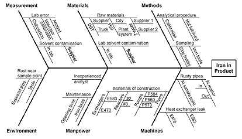

# 🐟 Project Histories

### Introduction

Project histories provide an important source of input to understanding what has gone wrong and what forces led to those problems.

The pillars of our approach are to:

* Establish a timeline that provides a basis for shared interpretation and causality of events&#x20;
* Get participation across a spectrum of teams that allows us to document the problems while also providing some inoculation for a sense of blame that can hamper progress
* Diagnose and document root causes along&#x20;

Collectively these ensure shared understanding among cross-functional teams, and (crucially) between teams and leadership that we’ve seen be very effective in changing organizational behavior and improving outcomes.\

### Key Steps Process Overview

1. Pre-work. Create a shared 1-slide visual Project Timeline of major events that forms the foundation for discussion. Determine attendees and schedule for workshops.
2. Session 1 agenda: share goals and process with team. Review Timeline to jog team’s memory and ask them to add any omitted events. Ensure Timeline captures most important events.
3. Async: each team member places three votes on the events that they believe were most impactful of GTM. We tally and sort the most important to the top.
4. Session 2 agenda: confirm or revise the voted priorities for top 3 events. Familiarize team with [fishbone analysis](https://asq.org/quality-resources/fishbone) process to identify multiple root causes. Explore 3-levels of causation for first event (and second, time permitting) and document causes.&#x20;
5. Session 3 agenda: Confirm or refine the prioritization of events. Conduct fishbone analysis and finalize documented root causes. Review and recap with team.

### Constructing a Timeline

We start by constructing a one-page timeline to form the basis of dicsussion. It's important for the team to see everything on a single page in order to jog their memory on what happened and in what order. This may be done graphically by drawing on a timeline, but we leverage a Sheet that makes it easy to take notes. Here is a [starting template](https://docs.google.com/spreadsheets/d/1ZZ1sI-PNOWu9kYTB6CjbHAkSoUgjMagEcbOXpVepeiA/edit?gid=0#gid=0).

### Categories of Exploration

During the root cause sessions, we explore with the team several categories of causes.

* Management / project team communication
* Function / function communication
* Requirements (internal)
* Environment or market (external)
* Process
* Technology

### Example and Origin of "fishbone"

The term "fishbone" comes from a graphical representation of the process that maps out the multiple root causes stemming from different [categories of exploration](project-histories.md#categories-of-exploration). While the name comes from this graphical model, for active note taking we use a spreadsheet with columns for each level of branching.

<figure><figcaption>
Fishbone diagram, from <a href="https://asq.org/quality-resources/fishbone">https://asq.org/quality-resources/fishbone</a>
</figcaption></figure>

